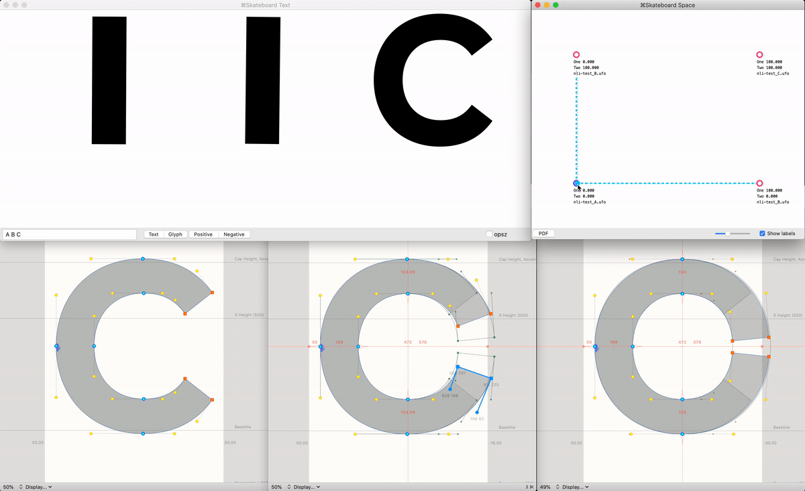
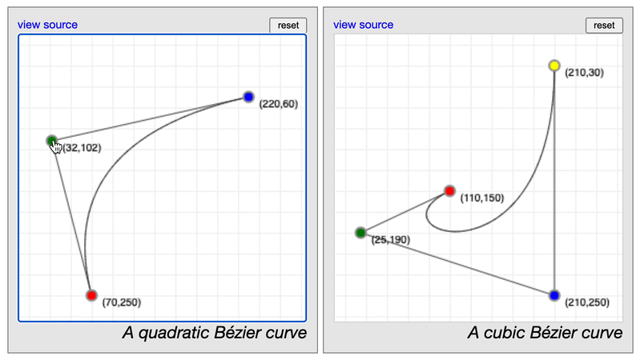

# Non-Linear Interpolation (NLI), a shared exploration & test

Recently, @blackfoundry has recently shared [some excellent examples of NLI on Twitter](https://twitter.com/blackfoundry/status/1325201254964883456). In fact, I think they may have coined the term NLI in terms of type design (but I’ll update this detail if I learn this is incorrect). A discussion of this prompted me to explore it further on my own, and I wanted to share the sources of this exploration, in hopes that it may help others to better understand this exploratory area of type design. So, this repo includes UFO sources plus a designspace which sets up a few simple non-linear interpolation tests:

- Rotating a rectangle by 90 degrees
- Rotating a rectangle by 180 degrees
- Smoothly opening & closing the letter C

## Background

A limitation of most interpolation for variable fonts is that it is only *linear* – points only move between sources in straight lines.

Of course, often as a type designer, what you really want to do is to control the curved paths that points would travel between different states. Put more simply, we want smooth & elaborate animations, but often end up working with much more subtle transformations because doing much more isn’t easy.

Underware Type has been exploring this in-depth for years, under a theory they have called [HOI: Higher-Order Interpolation](https://underware.nl/case-studies/hoi/). If you haven’t seen their talks on it yet, seriously, what they do is incredible and something you need to see.

Honestly, if you haven’t already seen Underware demo HOI, it would be very surprising that you are reading this right now. They have done a much better job of showing why it is an exciting possibility! This repo is just a quick way to test one approximation of it.

From what I understand, Underware uses a cubic-curve approach to this, which gives them fairly precise control over how points move in interpolations, allowing for extremely fluid animations.

If I try to summarize their approach, it is basically this (as far as I understand):

> A basic cubic bezier is drawn with:
> 1. A start point
> 2. An first offcurve point
> 3. A second offcurve point
> 4. An end point
> 
> In HOI, *each point* (on & offcurve) of a glyph has those four positions, in four font sources. A starting shape, and ending shape, and two shapes which are the "offcurve" positions of all points.
> 
> These sources can then be arranged in a three-axis, "cube shaped" designspace, and so long as you move all three axes at the same rate, each point can then move along a curved interpolation path.

Make sense? If not, don’t feel bad – I had to see this explained a bunch of times to finally start to grock it.

If it *does* make sense, you will then realize that the hard part is knowing how to *draw* those offcurve positions, because those shapes tend to look weird and are unintuitive.

One thing that can partially simplify that: instead of drawing cubic designspaces, you can instead draw quadratic designspaces – using just one "offcurve" source and only two axes. This simplifies the process somewhat.

If you draw type or use the pen tool in graphic software like Adobe Illustrator, you are familiar with cubic curves. But, quadratic curves are somewhat simpler. Here are two examples from the amazing [A Primer on Bézier Curves](https://pomax.github.io/bezierinfo/) (see this for a deep-dive on different types of Bézier curves as well as the math behind them):

So, we can use that same principle to create the middle drawing of an NLI designspace. And then critically, because of the way Bézier curves & interpolation work, you need to make *two* axes:

1. An axis going from Source A (start points in the interpolation) to Source B (offcurve points in the interpolation)
2. An axis going from Source B (yes, repeated) to Source C (end points in the interpolation)

Simplifying NLI by using a quadratic approach makes it reasonably approachable, so long as you have software like [RoboFont Skateboard](https://extensionstore.robofont.com/extensions/skateboard/) or [Variable Font Preview](https://markfromberg.com/index.php?/projects/variable-font-preview/) to preview the intermediate states of a designspace (you could also write your own extension or software to do so).

## Workflow

1. Draw Source A (start points)
2. Draw Source C (end points)
3. Copy Source A into Source B
4. Make a designspace as described above
5. Open a preview of the designspace in Skateboard, then set both axes to track the horizontal (or vertical) position of the Space Window
6. Set the values of both axes to 50%
7. Adust Source B to make the output look correct as the halfway point between A & C. Notably, Source B **won’t** look like the 50% shape – remember, this draw is just to set offcurves for interpolation paths, so it will be distorted by a little or a lot.

## Limitations of Quadratic NLI

Cubic curves can have create a much wider range of shapes than quadratic curves – see the Pomax guide’s [Circles and quadratic Bézier curves](https://pomax.github.io/bezierinfo/#circles) and [Circles and cubic Bézier curves](https://pomax.github.io/bezierinfo/#circles_cubic) for demoes & explanations of this.

Because quadratic curves are somewhat limited, that means that Quadratic NLI offers much more control than Linear interpolation, but not as much control as Cubic (or greater) NLI. But, it has the benefit of being more simpler to create than Cubic NLI.

Specific limitations found in these tests:
- A rectangle gets slightly smaller when rotating 90 degrees
- A rectangle gets noticeably smaller when rotating 180 degrees
- Does the `C` look good all the way through the interpolation? It probably depends on how particular you are about it. Certainly, it’s a much better transformation than linear interpolation would allow, but not perfect.
