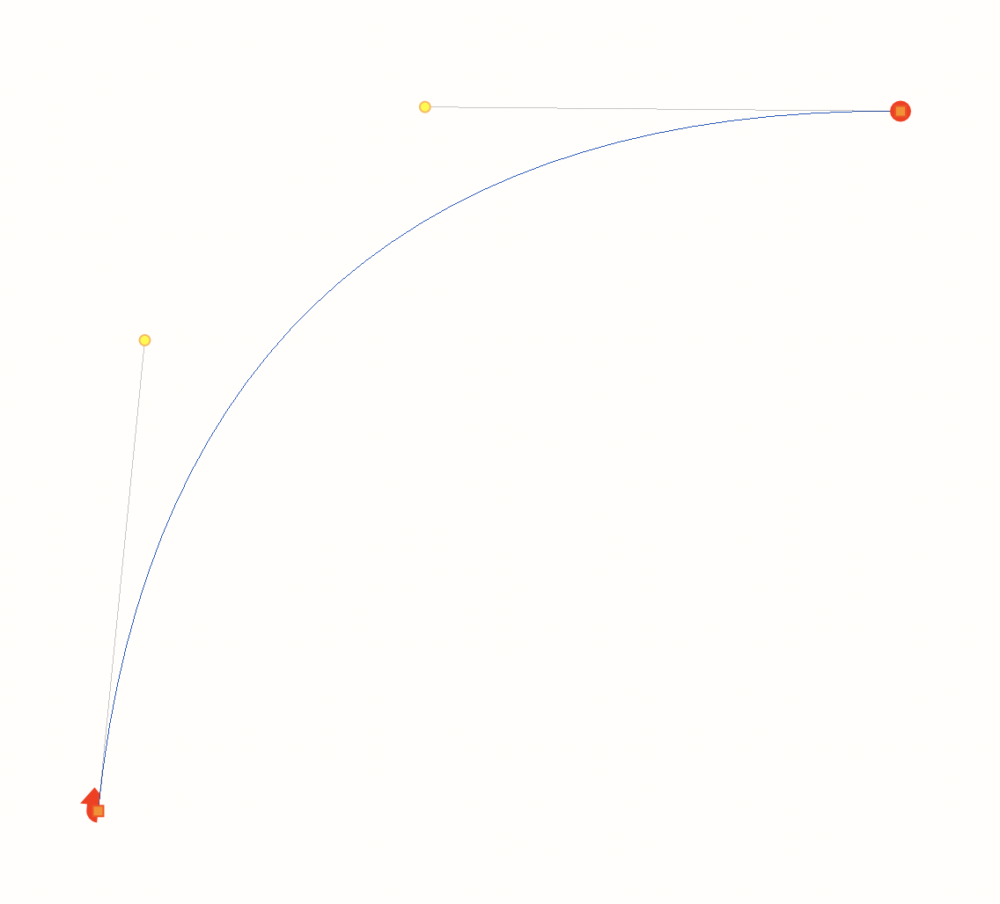

# A shared exploration of Higher-Order Interpreation (HOI), AKA Non-Linear Interpolation (NLI)

Editorial note, June 2025: This article was originally written and shared in November 2020. At the request of Underware, I made this full repo private and [re-released a simplified version]([url](https://github.com/arrowtype/NLI-test)), while Underware worked to further their commercialization of the idea of HOI. It’s been about 4.5 years since then, and Underware has made great strides, both in their technical execution of the technology and (seemingly) in their commercialization of it, as exemplified by their collaboration with Microsoft on [Kermit, the font](https://www.kermit-font.com/). So, it seems like a good time to re-publish this exploration and attempted explanation of the math that underpins the amazing visual feats.

---

[A simple web demo of this test font ↗](https://arrowtype.github.io/NLI-test/index.html)

In April 2018, Underware Type stunned the TypoLabs Berlin audience by announcing their new concept of *Higher-Order Interpolation* (HOI). They explained this in [a must-read article](https://underware.nl/case-studies/hoi/), complete with helpful diagrams & animations to show the discovery. In fact, they probably describe it better there than I have here, so you might consider saving time and going straight to the original. But, if you’re still confused, this article (and trying it for yourself) might help explain it further!

Recently, [@blackfoundry](https://github.com/BlackFoundryCom) has recently shared [some excellent examples of Non-Linear Interpolation (NLI) on Twitter](https://twitter.com/blackfoundry/status/1325201254964883456). In fact, I think they may have coined the term NLI in terms of type design. [A discussion of this](https://twitter.com/w__h_/status/1325223161395249152?s=20) prompted me to explore it further on my own. I never felt like I could quite understand the concept of NLI at a gut level – partly because I can get quickly confused by math, and partly because I just never took the time to do it myself.

Sidenote: I am mostly using the term *NLI* in this article – to me, NLI is a bit more of a focused, self-explanatory term for the mathematical/typographci theory I am covering here, while HOI in my mind encompasses UnderWare’s wider processes for making use of it. I say more about this below.

So, this weekend, I finally sat down to figure out a simple, working test. Having figured out how to reproduce the basics of NLI, I wanted to share the sources of this exploration, in hopes that it may help others to better understand this exploratory area of type design.

This repo includes UFO sources plus a designspace which sets up a few simple non-linear interpolation tests:

- Rotating a rectangle by 90 degrees
- Rotating a rectangle by 180 degrees
- Smoothly opening & closing the letter C


A later addition has added tests with Cubic NLI to show how Cubic interpolation is possible, but somewhat harder to achieve, and an example using standard (linear) interpolation to show its limitations.

Later edit (Sep 2023): BlackFoundry also shared [this script for generating the unintuitive "offcurve" source](https://github.com/BlackFoundryCom/bezier-interpolation/tree/main) from an intuitive "target" source and two poles. I don’t think I had previously linked to it in this article, but it would be a useful part of making a proper design workflow for HOI/NLI.

## Additional Background

### Interpolation

Variable fonts use *interpolation* to create intermediate results from two or more sources. [RoboFont defines interpolation](https://robofont.com/documentation/how-tos/interpolation-introduction/) in a helpful way:

> At its most basic level, interpolation is finding a number between two other numbers.
> 
> The basic interpolation formula is: start with one value (a), than add a fraction (factor) of the difference with another value (b).
> 
> a + factor * (b - a)

### Linear interpolation

Linear interpolation is by far the most common technique used to create variable type. To make a basic linear interpolation, you must draw two shapes (e.g. a thin `A` and a bold `A`) which have the same number of points. Then, you can easily generate shapes that are some 25% or 50% or 63.45% between these by simply moving each point to that percentage distance between its position in the light & bold drawings.

Linear interpolation is used to create basic all the fonts you know and love, and people do incredible things with it. In large part, this is because variable fonts allow multiple linear interpolations to be done at the same time, allowing a very wide *designspace* of possibilities.

Linear interpolation does has some limitations, though. Chiefly, it is *linear* – that is, the way points move between states is always in a straight line (if only one variable axis is changed). This means that, for instance, rotation of shapes is not possible in a linear interpolation.

If you try to rotate a rectangle with just two sources or create a `C` that opens and closes, the results show the limitations. The rectangle does a weird inversion rather than a rotation, and the C doesn’t change in the “circular” way you’d expect.


A limitation of most interpolation for variable fonts is that it is only *linear* – points only move between sources in straight lines (more ont this below).

### Non-Linear Interpolation

Of course, often as a type designer, what you really want to do is to control the curved paths that points would travel between different states. Put more simply, we want smooth & elaborate animations, but often end up working with much more subtle transformations because doing much more isn’t easy.

Underware Type has been exploring this area of interpolation theory in-depth for years, under a theory they have called [HOI: Higher-Order Interpolation](https://underware.nl/case-studies/hoi/) and later [Grammatography](http://www.grammato.com/). If you haven’t seen their talks on it yet, seriously, what they do is incredible and something you need to see.

Honestly, if you haven’t already seen Underware demo HOI, it would be very surprising that you are reading this right now. They have done a much better job of showing why it is an exciting possibility! And really, as explained below, achieving NLI is difficult, so whatever *HOI* is is as much about the tools, processes, and methods they have created internally to make this work at scale.

By contrast, this repo is just a quick way to test one small aspect of NLI: how can a fairly-average person, with widely-available tools, draw type that has curved interpolation paths?

## Cubic NLI

If you draw type or use the pen tool in graphic software like Adobe Illustrator, you are already familiar with cubic curves. Here is a cubic curve as respresented in RoboFont:



A cubic bezier is drawn with:

1. A start point
2. A first offcurve point
3. A second offcurve point
4. An end point

Cubic NLI, then, takes this concept and applies it to interoplation

- In Cubic NLI, *each point* (on & offcurve) of a glyph has those four positions, in four font sources. A starting shape, and ending shape, and two shapes which are the "offcurve" positions of all points.
- These four sources can then be arranged in a three-axis, "cube shaped" designspace, with sources repeated to fill the 8 corners.
- Then, so long as you move all three axes at the same rate, each point can then move along a curved interpolation path.

The eight corners of the designspace make a cube with the four sources: A is the start, B is the end, and C & D are the offcurves. XYZ are the axes.

```
A: X=0   Y=0   Z=0
C: X=100 Y=0   Z=0
C: X=0   Y=100 Z=0
C: X=0   Y=0   Z=100
D: X=100 Y=100 Z=0
D: X=0   Y=100 Z=100
D: X=100 Y=0   Z=100
B: X=100 Y=100 Z=100
```

This cube, then, looks something like this:

```
             D – – – – – – – B 
           / |             / | 
         /   |           /   | 
       /     |         /     | 
     /       |       /       | 
   C – – – – – – – C         | 
   |         |     |         | 
   |         D – – | – – – – D 
 ↑ |    ↗  /       |       /   
 z |  y  /         |     /     
   |   /           |   /       
   | /             | /         
   A – – – – – – – C           
           x →                 
```

When you move axes X, Y, & Z, the points can move in a smooth, cubic-curved interplation.

Make sense? If not, don’t worry – I had to see this explained a bunch of times to finally start to grock it. (There is still a lot about this that I don’t entirely understand, either.)

If it *does* make some sense, you will then realize that the hard part is knowing how to *draw* those offcurve positions, because those shapes tend to look weird and are unintuitive.

One thing that can partially simplify that: instead of drawing cubic designspaces, you can instead draw quadratic designspaces – using just one "offcurve" source and only two axes. This simplifies the process somewhat.

## Quadratic NLI

Quadratic curves are somewhat simpler, and this allows quadratic NLI to be somewhat simpler, too. 

Here is a comparison from the amazing [Primer on Bézier Curves by Pomax](https://pomax.github.io/bezierinfo/) (see this for a deep-dive on different types of Bézier curves as well as the math behind them):


So, we can use that same principle to create the middle drawing of an NLI designspace. And then critically, because of the way Bézier curves & interpolation work, you need to make *two* axes:

1. An axis going from Source A (start points in the interpolation) to Source B (offcurve points in the interpolation)
2. An axis going from Source B (yes, repeated) to Source C (end points in the interpolation)

```
A: X=0   Y=0  
C: X=100 Y=0  
C: X=0   Y=100
B: X=100 Y=100
```

This square, then, looks something like this:

```
   C – – – – – – – – B
   |                 |
   |                 |
 ↑ |                 |
 y |                 |
   |                 |
   |                 |
   A – – – – – – – – C
           x →        
```

Simplifying NLI by using a quadratic approach makes it reasonably approachable, so long as you have software like [RoboFont Skateboard](https://extensionstore.robofont.com/extensions/skateboard/) or [Variable Font Preview](https://markfromberg.com/index.php?/projects/variable-font-preview/) to preview the intermediate states of a designspace (you could also write your own extension or software to do so).

## Quadratic NLI workflow

1. Draw Source A (start points)
2. Draw Source C (end points)
3. Copy Source A into Source B
4. Make a designspace as described above
5. Open a preview of the designspace in Skateboard, then set both axes to track the horizontal (or vertical) position of the Space Window
6. Set the values of both axes to 50%
7. Adust Source B to make the output look correct as the halfway point between A & C. Notably, Source B **won’t** look like the 50% shape – remember, this draw is just to set offcurves for interpolation paths, so it will be distorted by a little or a lot.

## Cubic NLI workflow

A workflow for Cubic NLI can be roughly similar to the quadratic workflow, but can involve drawing intended interpolation curves on a background layer, then matching this in the intermediate sources.

## Cubic vs Quadratic NLI

Cubic curves can create a much wider range of shapes than quadratic curves – see the Pomax guide’s [Circles and quadratic Bézier curves](https://pomax.github.io/bezierinfo/#circles) and [Circles and cubic Bézier curves](https://pomax.github.io/bezierinfo/#circles_cubic) for demoes & explanations of this.

Because quadratic curves are somewhat limited, that means that Quadratic NLI offers much more control than Linear interpolation, but not as much control as Cubic (or greater) NLI. But, it has the benefit of being more simpler to create than Cubic NLI.

Specific limitations found in these quadratic NLI tests:
- A rectangle gets slightly smaller when rotating 90 degrees
- A rectangle gets noticeably smaller when rotating 180 degrees
- Does the `C` look good all the way through the interpolation? It probably depends on how particular you are about it. Certainly, it’s a much better transformation than linear interpolation would allow, but not perfect.

These can be made better in Cubic interpolations, but as you can see, Cubic interpolations are somewhat more difficult to draw. And if you layered on additional axes (like Weight), this would all get even more complex. So, for some projects, quadratic NLI might be just the right balance of interpolation control with an accessible workflow.

I’ve [posted about this on Twitter](https://twitter.com/ArrowType/status/1325648820101853184). If you have a question or comment, feel free to join in on the discussion!

## Life beyond Quadratic & Cubic NLI

The examples here only cover quadratic & cubic NLI. Or, as UnderWare would call it, just the first two “orders” of interpolation. If you wish to make a point curve in more complex ways (e.g. to make a full rotatation or a compound/S-shaped curve), there are basically two options:

- Interpolating with a higher order, which adds n+1 source & axis for each order
- Stacking up multiple interpolations, perhaps using designspace “rules” (OpenType `rvrn` or `rclt` substitutions), e.g. to swap from `C.part1` to `C.part2` and so on. The advantage here is that it easier to draw plans for in existing tools, and easier to mentally consider.

## Is this practical?

Clearly, [UnderWare has already shown](http://www.grammato.com/) that they can make fonts using curved interpolation for such purposes of making fonts that can better reproduce handwriting for striking visual effects. BlackFoundry is using the concept to make more-flexible components.

It’s hard to say for sure whether NLI will be a technique adopted by the mainstream of type designers. There are hurdles: as complicated as it is to produce even a quadratic NLI, it would likely require at twice as many drawings to produce a typical *Weight* axis on top of this. For me, this is hard to imagine – but maybe I just have to try it before knowing.

In the long run, it seems likely or inevitable that NLI will be used by more designers, but it will require new tools to make the technique accessible & efficient. Here’s hoping to a Non-Linear future!
